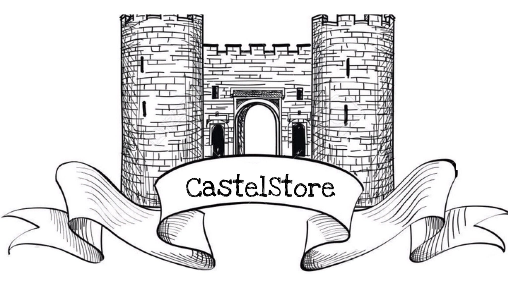

# Castel'Store

Castel'Store is an online app store for Polytech students



## Links

Deployed app: https://castelstore.igpolytech.fr/

## Getting started

### Requirements

- [PotgreSQL](https://www.postgresql.org/)
- [Node.js](https://nodejs.org/en/)

### Launch

First, run PostreSQL.

```shell script
git clone https://github.com/MatthieuDye/awi-appstore.git
cd awi-appstore
```
On one terminal:
```shell script
cd client
npm install
npm start
```

On a second terminal:
```shell script
cd server
npm install
npm start
```

Your app is now running at the following link: http://localhost:3000/

### Tests

You can run the tests in /client folder by using the following command: 

```shell script
npm test
```

## Authors

* **Alia CHAWAF** - [aliachawaf](https://github.com/aliachawaf)
* **Matthieu DYE** - [MatthieuDye](https://github.com/MatthieuDye)
* **Marine GARDEISEN** - [Gardeisen](https://github.com/Gardeisen)
* **Rémi GESTIN** - [Remigestin](https://github.com/Remigestin)
* **Nathan GUILLAUD** - [NathanGuillaud](https://github.com/NathanGuillaud)
* **William REGNART** - [williamregnart](https://github.com/williamregnart)
